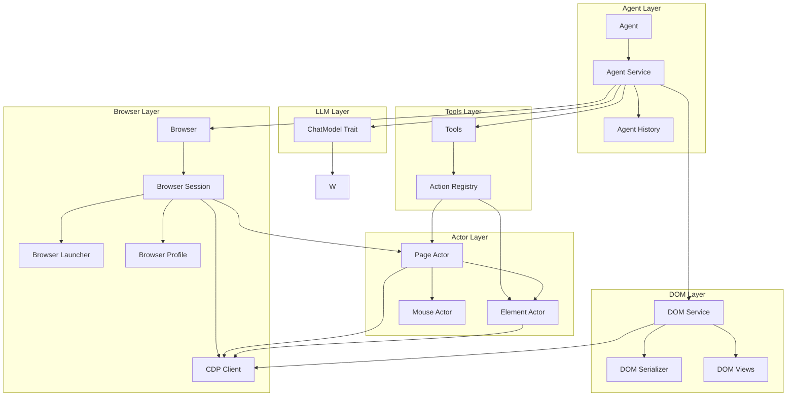

# Architecture

## Overview

Browser-Use Rust is a single-crate implementation of the browser automation library. The architecture follows a modular design within a single crate, providing a clean separation of concerns while maintaining simplicity.

## Module Structure

```
browser-use/
├── agent/          # High-level agent orchestration
│   ├── service.rs  # Agent execution loop
│   └── views.rs    # Agent data structures
├── browser/        # Browser session and CDP management
│   ├── session.rs  # Browser session lifecycle
│   ├── cdp.rs      # CDP WebSocket client
│   ├── launcher.rs # Local browser launcher
│   ├── profile.rs  # Browser configuration
│   └── views.rs    # Browser state types
├── dom/            # DOM parsing and serialization
│   ├── service.rs  # DOM extraction service
│   ├── serializer.rs # LLM-ready serialization
│   ├── enhanced_snapshot.rs # CDP snapshot processing
│   └── views.rs    # DOM data structures
├── llm/            # LLM integration
│   └── base.rs     # ChatModel trait
├── tools/          # Action/tool registry
│   ├── service.rs  # Tools service
│   └── views.rs    # Action types
├── actor/          # Low-level browser interactions
│   ├── page.rs     # Page operations
│   ├── element.rs  # Element operations
│   └── mouse.rs    # Mouse interactions
├── config/         # Configuration and environment
├── error/          # Error types
├── utils/          # Utility functions
│   ├── signal.rs   # Signal handling for graceful shutdown
│   └── ...         # URL extraction, domain matching
└── views/          # Shared data structures
```

## Component Relationships



## Data Flow

### 1. Agent Initialization

```
Agent::new(task, browser, llm)
  ├── Initialize Browser (with profile)
  ├── Initialize DOM Service
  ├── Initialize Tools Registry
  └── Initialize History Tracking
```

### 2. Browser Launch

```
Browser::start()
  ├── Check for CDP URL
  │   ├── If provided: Connect to existing browser
  │   └── If not: Launch local browser
  │       ├── BrowserLauncher::launch()
  │       │   ├── Find browser executable
  │       │   ├── Find free port
  │       │   ├── Build launch args
  │       │   ├── Launch subprocess
  │       │   └── Wait for CDP ready
  │       └── Connect via CDP
  └── Create CDP session
```

### 3. Execution Loop

```
Agent::run()
  ├── Set up signal handler for graceful shutdown
  ├── For each step:
  │   ├── Check shutdown flag (exit if requested)
  │   ├── Get page state
  │   │   └── DOM Service::get_serialized_dom_tree()
  │   │       ├── Get all trees (snapshot, DOM, AX)
  │   │       ├── Build enhanced DOM tree
  │   │       └── Serialize for LLM
  │   ├── Build messages for LLM
  │   ├── Query LLM for next action
  │   ├── Parse action from LLM response
  │   │   └── JSON repair if needed
  │   ├── Execute action via Tools
  │   │   └── Use Actor (Page/Element) for interaction
  │   ├── Record in history
  │   └── Check if task complete
  └── Return history
```

### 4. DOM Extraction Flow

```
DOM Service::get_dom_tree()
  ├── _get_all_trees() [parallel]
  │   ├── DOMSnapshot.captureSnapshot
  │   ├── DOM.getDocument
  │   ├── Accessibility.getFullAXTree
  │   └── Page.getLayoutMetrics (device pixel ratio)
  ├── Build snapshot lookup
  ├── Build AX tree lookup
  ├── _construct_enhanced_node() [recursive]
  │   ├── Extract node properties
  │   ├── Merge snapshot data
  │   ├── Merge AX data
  │   ├── Calculate absolute position
  │   └── Process children/iframes/shadow roots
  └── Return EnhancedDOMTreeNode
```

### 5. Screenshot Flow

```
Browser::take_screenshot()
  ├── Get Page actor
  ├── Page::screenshot_with_options()
  │   └── CDP: Page.captureScreenshot
  ├── Decode base64
  └── Save to file (if path provided)
```

## Key Design Decisions

### 1. Single Crate Architecture

- **Rationale**: Simpler dependency management and faster compilation
- **Trade-off**: Less modularity, but acceptable for this project size

### 2. Async/Await Throughout

- **Rationale**: Browser automation is inherently I/O-bound
- **Implementation**: Full async support using Tokio

### 3. Trait-based LLM Integration

- **Rationale**: Allows multiple LLM providers
- **Implementation**: `ChatModel` trait for any LLM provider

### 4. Enhanced DOM Nodes

- **Rationale**: Combines best data from multiple CDP sources
- **Implementation**: Merges DOM, AX, and Snapshot trees into unified structure

### 5. Actor Pattern for Browser Interactions

- **Rationale**: Clean separation between high-level (Agent) and low-level (Actor) operations
- **Implementation**: Page, Element, Mouse actors for granular control

### 6. Signal Handling

- **Rationale**: Graceful shutdown on SIGINT/SIGTERM for production deployments
- **Implementation**: Background signal listener with global shutdown flag
- **Integration**: Agent checks shutdown flag during execution loop

## Error Handling

All operations return `Result<T, BrowserUseError>`:

```rust
pub enum BrowserUseError {
    Browser(String),
    Cdp(String),
    Dom(String),
    Llm(String),
    Agent(String),
    // ...
}
```

## Concurrency Model

- **CDP Client**: Single WebSocket connection with request/response correlation
- **DOM Extraction**: Parallel fetching of CDP trees using `try_join4`
- **Agent Loop**: Sequential steps with async operations
- **Browser Launch**: Async subprocess management

## Memory Management

- **Arc Sharing**: CDP client and browser shared across components
- **Ownership**: Clear ownership boundaries (Browser owns CDP, Agent owns Browser)
- **Lifetimes**: Minimal lifetime annotations due to Arc usage

## Dependencies

### Core
- **tokio**: Async runtime (full features)
- **serde/serde_json**: Serialization
- **reqwest**: HTTP client

### Browser Automation
- **tokio-tungstenite**: WebSocket for CDP
- **futures-util**: Stream utilities

### LLM Integration
- **anyrepair**: JSON repair for LLM responses

### Utilities
- **base64**: Encoding/decoding
- **uuid**: Unique identifiers
- **regex**: Pattern matching
- **url**: URL parsing

## Testing Strategy

### Unit Tests
- ✅ Individual component testing (42 tests)
- ✅ Mock CDP responses
- ✅ Isolated actor operations
- ✅ Signal handling tests

### Integration Tests
- ✅ Full agent execution (24 comprehensive tests)
- ✅ Browser launch and cleanup
- ✅ DOM extraction end-to-end
- ✅ Mock LLM integration
- ✅ Custom action registration
- ✅ Action parameter validation

### Snapshot Tests
- ⏳ DOM serialization output - Optional
- ⏳ Agent history format - Optional
- ⏳ Error message formats - Optional

## Future Enhancements

1. ✅ **Tab Management**: Multi-tab support - Complete
2. ✅ **Custom Actions**: User-defined action registration - Complete
3. ✅ **Token Counting**: LLM usage tracking - Complete
4. ✅ **Signal Handling**: Graceful shutdown - Complete
5. ⏳ **Advanced DOM Features**: Paint order filtering, enhanced markdown - Optional
6. ⏳ **Telemetry**: Optional usage analytics - Optional
7. ⏳ **Cost Calculation**: Token cost tracking - Optional

## Performance Considerations

- **Parallel CDP Calls**: DOM extraction uses parallel fetching
- **Lazy Evaluation**: DOM tree built on-demand
- **Memoization**: Node lookup prevents duplicate construction
- **Streaming**: LLM responses streamed when possible

## Security Considerations

- **Sandboxing**: Browser launched with appropriate flags
- **Input Validation**: All user inputs validated
- **Error Messages**: Sensitive data not exposed in errors
- **Process Isolation**: Browser runs in separate process
