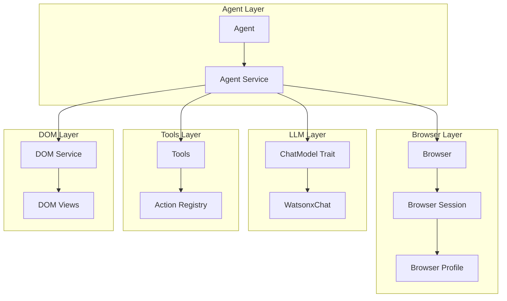

# Architecture

## Overview

Browser-Use Rust is a single-crate implementation of the browser automation library. The architecture follows a modular design within a single crate.

## Module Structure

```
browser-use/
├── agent/          # High-level agent orchestration
├── browser/        # Browser session and CDP management
├── config/         # Configuration and environment
├── dom/            # DOM parsing and serialization
├── error/          # Error types
├── llm/            # LLM integration (Watsonx)
├── tools/          # Action/tool registry
├── utils/          # Utility functions
└── views/          # Data structures and view types
```

## Component Relationships



## Data Flow

1. **Agent Initialization**
   - Agent is created with task, browser, and LLM
   - Tools registry is initialized

2. **Execution Loop**
   - Agent gets page state from browser
   - DOM service extracts page content
   - Agent queries LLM for next action
   - Action is executed via browser
   - Result is evaluated
   - Loop continues until task complete or max steps reached

3. **Browser Interaction**
   - Browser manages CDP connection
   - Commands sent via WebSocket
   - Events received and processed
   - Page state captured periodically

## Key Design Decisions

1. **Single Crate**: All code in one crate for simplicity
2. **Async/Await**: Full async support using Tokio
3. **Trait-based LLM**: ChatModel trait for extensibility
4. **Type Safety**: Strong typing with Result types
5. **Watsonx First**: Primary LLM integration is Watsonx

## Dependencies

- **tokio**: Async runtime
- **reqwest**: HTTP client
- **serde**: Serialization
- **watsonx-rs**: Watsonx SDK
- **anyrepair**: JSON repair
- **rmcp**: MCP support
- **tokio-tungstenite**: WebSocket for CDP

