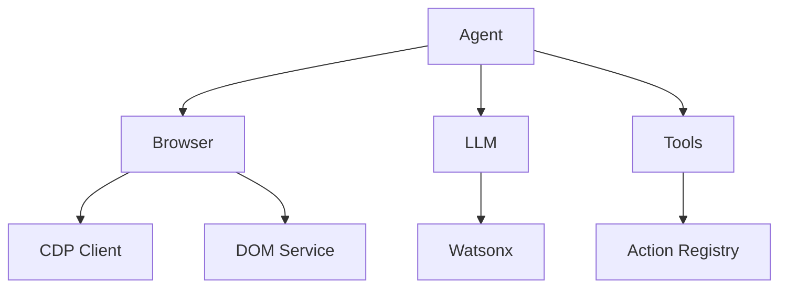

# Browser-Use Rust

Rust implementation of Browser-Use - Make websites accessible for AI agents.

## Status

🚧 **Work in Progress** - This is an active migration from the Python implementation.

## Architecture



## Project Structure

```
browser-use-rs/
├── src/
│   ├── agent/          # Agent service for autonomous web automation
│   ├── browser/        # Browser session and CDP management
│   ├── config/         # Configuration management
│   ├── dom/            # DOM parsing and serialization
│   ├── error/          # Error types
│   ├── llm/            # LLM integration (Watsonx)
│   ├── tools/          # Tools and actions registry
│   ├── utils/          # Utility functions
│   └── views/          # View types and data structures
├── Cargo.toml
└── README.md
```

## Getting Started

### Prerequisites

- Rust 1.88+ (edition 2024)
- Chromium browser (for CDP)

### Installation

```bash
git clone <repository>
cd browser-use-rs
cargo build
```

### Usage

```rust
use browser_use::{Agent, Browser, BrowserProfile, WatsonxChat};

#[tokio::main]
async fn main() -> Result<(), Box<dyn std::error::Error>> {
    let profile = BrowserProfile::default();
    let browser = Browser::new(profile);
    let llm = WatsonxChat::new(
        std::env::var("WATSONX_API_KEY")?,
        Some("ibm/granite-4-h-small".to_string()),
    );
    
    let mut agent = Agent::new(
        "Find the number 1 post on Show HN".to_string(),
        browser,
        llm,
    );
    
    agent.run().await?;
    Ok(())
}
```

## Migration Progress

See [TODO.md](TODO.md) for detailed migration status.

## License

MIT

