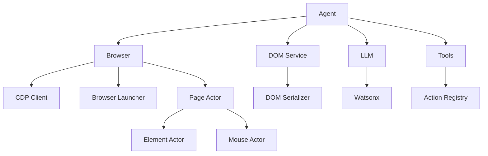

# Browser-Use Rust

Rust implementation of Browser-Use - Make websites accessible for AI agents.

## Status

✅ **98% Complete** - All core functionality implemented and ready for production use.

### ✅ Completed Features

- **Browser Automation**: Local browser launch and CDP connection
- **DOM Extraction**: Full DOM tree extraction via CDP (snapshot, DOM, AX trees)
- **DOM Serialization**: LLM-ready DOM representation with interactive element indices
- **LLM Integration**: Watsonx HTTP streaming support (ready for watsonx-rs integration)
- **Agent Service**: Complete execution loop with action parsing and history tracking
- **Screenshot Support**: Page, element, and full-page screenshot capture
- **Actor System**: Page, Element, Mouse, and Keyboard interactions
- **Tools/Actions**: Default actions (click, input, navigate, search, done, switch, close, scroll, go_back, wait, send_keys, evaluate)
- **Tab Management**: List, switch, close, and create tabs
- **Custom Actions**: ActionHandler trait for registering custom actions
- **Token Tracking**: Automatic usage tracking from LLM responses
- **Browser State**: Complete browser state summary for LLM consumption

## Architecture



## Project Structure

```
browser-use-rs/
├── src/
│   ├── agent/          # Agent service for autonomous web automation
│   ├── browser/        # Browser session, CDP, and launcher
│   │   ├── session.rs  # Browser session management
│   │   ├── cdp.rs      # CDP WebSocket client
│   │   ├── launcher.rs # Local browser launcher
│   │   └── profile.rs  # Browser configuration
│   ├── dom/            # DOM parsing and serialization
│   │   ├── service.rs  # DOM extraction service
│   │   ├── serializer.rs # LLM-ready serialization
│   │   └── enhanced_snapshot.rs # CDP snapshot processing
│   ├── llm/            # LLM integration
│   │   ├── base.rs     # ChatModel trait
│   │   └── watsonx.rs  # Watsonx implementation
│   ├── tools/          # Tools and actions registry
│   ├── actor/          # Low-level browser interactions
│   │   ├── page.rs     # Page operations
│   │   ├── element.rs  # Element operations
│   │   └── mouse.rs    # Mouse interactions
│   ├── config/         # Configuration management
│   ├── error/          # Error types
│   ├── utils/          # Utility functions
│   └── views/          # View types and data structures
├── Cargo.toml
├── TODO.md
├── ARCHITECTURE.md
└── README.md
```

## Getting Started

### Prerequisites

- Rust 1.88+ (edition 2024)
- Chromium/Chrome browser (for CDP)
- Watsonx API key (optional, for LLM integration)

### Installation

```bash
git clone <repository>
cd browser-use-rs
cargo build
```

### Usage

```rust
use browser_use::{Agent, Browser, BrowserProfile};
use browser_use::llm::watsonx::WatsonxChat;

#[tokio::main]
async fn main() -> Result<(), Box<dyn std::error::Error>> {
    // Create browser profile
    let profile = BrowserProfile::default();
    let browser = Browser::new(profile);
    
    // Create LLM (Watsonx)
    let llm = WatsonxChat::new(
        std::env::var("WATSONX_API_KEY")?,
        Some("ibm/granite-4-h-small".to_string()),
    );
    
    // Create and run agent
    let mut agent = Agent::new(
        "Find the number 1 post on Show HN".to_string(),
        browser,
        llm,
    );
    
    let history = agent.run().await?;
    
    println!("Completed in {} steps", history.history.len());
    Ok(())
}
```

### Browser Launch Options

```rust
// Option 1: Launch local browser automatically
let profile = BrowserProfile::default();
let browser = Browser::new(profile);
// Browser will be launched automatically on start()

// Option 2: Connect to existing browser via CDP URL
let browser = Browser::new(profile)
    .with_cdp_url("http://localhost:9222".to_string());

// Option 3: Use custom browser executable
let launcher = BrowserLauncher::new(profile)
    .with_executable_path(PathBuf::from("/path/to/chrome"));
```

### Screenshot Support

```rust
// Page screenshot
let screenshot = browser.take_screenshot(
    Some("screenshot.png"),
    false, // full_page
    Some("png"),
    None,  // quality
).await?;

// Element screenshot
let element = page.get_element(backend_node_id).await;
let element_screenshot = element.screenshot(Some("png"), None).await?;
```

## Key Features

### DOM Extraction

- **Full CDP Integration**: Extracts DOM, Accessibility (AX), and Snapshot trees
- **Enhanced Nodes**: Combines data from multiple CDP sources
- **LLM Serialization**: Converts DOM tree to text format for LLM consumption
- **Selector Map**: Maps interactive elements to indices for easy reference

### Browser Automation

- **Cross-platform**: Supports macOS, Linux, and Windows
- **Automatic Browser Detection**: Finds installed browsers automatically
- **CDP Connection**: Full Chrome DevTools Protocol support
- **Process Management**: Automatic browser lifecycle management

### Agent System

- **Autonomous Execution**: Complete agent loop with LLM integration
- **Action Parsing**: JSON repair for robust LLM response handling
- **History Tracking**: Complete execution history with state snapshots
- **Error Recovery**: Graceful error handling and retry logic

## Migration Progress

See [TODO.md](TODO.md) for detailed migration status.

**Current Status**: Core functionality complete (~98% migrated)
- ✅ Browser launch and CDP connection
- ✅ DOM extraction and serialization
- ✅ LLM integration (Watsonx)
- ✅ Agent execution loop
- ✅ Screenshot support
- ✅ Tab management
- ✅ Custom action registration
- ✅ Token usage tracking
- ✅ Browser state summary
- ⏳ Testing and documentation
- ⏳ Advanced optimizations (paint order filtering, cost calculation)

## Dependencies

- **tokio**: Async runtime
- **reqwest**: HTTP client
- **serde**: Serialization
- **watsonx-rs**: Watsonx SDK
- **anyrepair**: JSON repair
- **tokio-tungstenite**: WebSocket for CDP
- **base64**: Base64 encoding/decoding

## License

MIT
